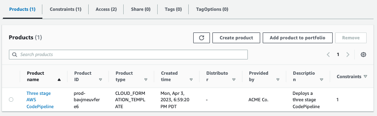
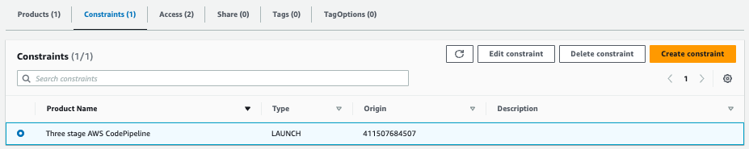
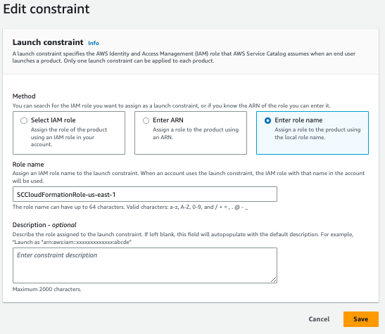

# Managing Service Catalog Portfolios

As an administrator, you can manage your Service Catalog Portfolios via the web console.

A Service Catalog *portfolio* contains a list of products. Navigate to the ```Service Catalog``` web page and then click on ```Portfolios``` on the side.

##  Products

The first tab displays a list of products contained in the portfolio.



## Launch constraints

You apply [constraints](https://docs.aws.amazon.com/servicecatalog/latest/adminguide/constraints.html) to control the rules that are applied to a product in a specific portfolio when the end users launches it. When the end users launches the product, they will see the rules you have applied using constraints.

This framework uses [launch constraints](https://docs.aws.amazon.com/servicecatalog/latest/adminguide/constraints-launch.html).  

A launch constraint specifies the AWS Identity and Access Management (IAM) role that Service Catalog assumes when an end user launches, updates, or terminates a product.

Click on the ```Constraints``` tab and you will see a list of products and the constraints that are attached to them.



Then click on ```Edit Constraints```.



This tells you that when the user provisions a product (creates a CloudFormation stack), Service Catalog will assume the role ```SCCloudFormationRole-us-east-1``` to provision the product on behalf of the user.

Since IAM is a global resource, if the region were not appended to the role, a Portfolio created via CloudFormation in one region would conflict with a Portfolio created in another region.

## Access

The ```Access``` tab is how you give a user access to a Portfolio by specifying IAM [groups, users, or roles](https://docs.aws.amazon.com/IAM/latest/UserGuide/id.html).

Even if a user has permissions to Service Catalog itself via IAM permissions, you must explicitly give a user access to a portfolio.

By default, when you deploy the framework, any role that has either the ```ServiceCatalogEndUser``` or ```ServiceCatalogAdmin``` [managed policy](https://docs.aws.amazon.com/IAM/latest/UserGuide/access_policies_managed-vs-inline.html) will be given access to the portfolio. You can include more policies by modifying the [Service Catalog CloudFormation template](./components/service-catalog-portfolios/service-catalog-portfolio.yml).