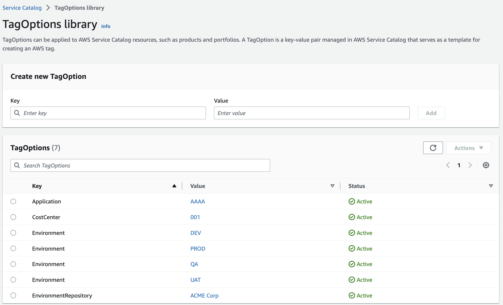
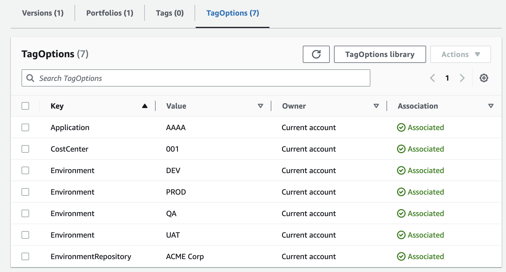
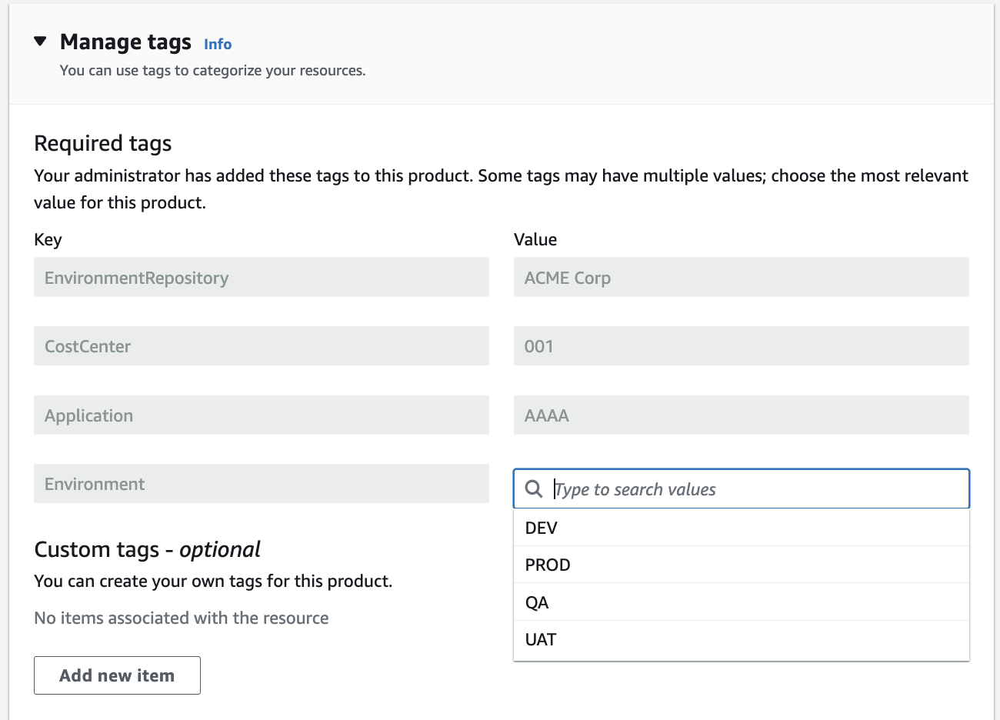

# Tagging resources created by the Service Catalog Framework

The Service Catalog Framework takes advantage of the [AWS Service Catalog TagOption Library](https://docs.aws.amazon.com/servicecatalog/latest/adminguide/tagoptions.html).

The TagOption library makes it easier to enforce the following:

- A consistent taxonomy
- Proper tagging of Service Catalog resources
- Defined, user-selectable options for allowed tags

Administrators can associate TagOptions with portfolios and products. During a product launch (provisioning), Service Catalog aggregates the associated portfolio and product TagOptions, and applies them to the provisioned product

## Configuring the TagOptions Library

To use the TagOptions library, a [AWS::ServiceCatalog::TagOption](https://docs.aws.amazon.com/AWSCloudFormation/latest/UserGuide/aws-resource-servicecatalog-tagoption.html) resource must be created and then a [AWS::ServiceCatalog::TagOptionAssociation](https://docs.aws.amazon.com/AWSCloudFormation/latest/UserGuide/aws-resource-servicecatalog-tagoptionassociation.html) resource has to be created to associate a tag option to a product or portfolio.

The Service Catalog Framework eases that process by allowing you to specify your tags in a json configuration file. For information about how the configuration file is preprocessed, see the [replace environment variables documenation](./scripts/replace-environment-vars.md).

```json
{
    "Configuration": [
        {
            "Key": "Application",
            "Value": "${Application}",
            "Default": "AAAA",
            "Description": "The name of the application"
        },
        {
            "Key": "Owner",
            "Value": "${Application}",
            "Default": "BBBB",
            "Description": "The owner of the product (Free Text)",
            "CreateTagOption":false
        },
        {
            "Key": "CostCenter",
            "Value": "${CostCenter}",
            "Default": "001"
        },
        {
            "Key": "Environment",
            "Value": "${Environment}",
            "Default": "DEV",
            "AllowedValues": [
                "DEV",
                "QA",
                "UAT",
                "PROD"
            ]
        }
    ]
}
```

An entry in the tag option library is added for each item under ```Configuration``` unless there is a property ```CreateTagOption``` with a value of ```false```. The tag option is then added to the Service Catalog product. 

Any resource contained within the CloudFormation template that defines the product will have the appropriate tags applied.

## Viewing Tag Options as an Administrator

You can see the created Tag Options by navigating to the Service Catalog page in the AWS Console and choosing ```TagOptions Library``` in the left panel.



In the example above, the user can choose between three Environment values.

Then the tags in the Tag Options library are associated with the product.  You can navigate to the product and then to the ```Tags``` tab to see the associated tags.



## Adding tags to provisioned products

When you launch a product, at the bottom you will see the tag options.  If a tag has multiple options available like ```Environment```, the user has to choose an option.

