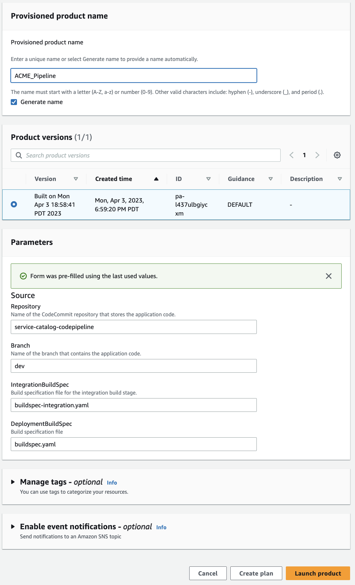

# Using Service Catalog

[AWS Service Catalog](https://docs.aws.amazon.com/servicecatalog/latest/adminguide/introduction.html) enables organizations to create and manage catalogs of IT services that are approved for AWS. 

At it's core, Service Catalog provides a curated list of *products* defined by [AWS CloudFormation](https://docs.aws.amazon.com/servicecatalog/latest/adminguide/introduction.html) templates.  It allows users with limited permissions on AWS to manage and deploy CloudFormation templates within guardrails defined by adminstrators/

## Provisioning and managing products

A Service Catalog *product* is an [AWS CloudFormation](https://aws.amazon.com/cloudformation/resources/templates/) template stored in [Amazon S3](https://aws.amazon.com/s3/). 

A *provisioned product* represents a [CloudFormation stack](https://docs.aws.amazon.com/AWSCloudFormation/latest/UserGuide/stacks.html) that was defined by the product.

### Provisioning a product

When an end user with permission to launch and manage products logs into AWS and navigates to the ```Service Catalog``` web page, they will see all of their available products.


From here, you can click on the product you wish to provision and choose ```Launch Product```.  


You will be presented with a page that allows you to enter a name for your provisioned product, the version you would like to provision and enter parameters.



The ```Parameters``` are defined by the [Parameters section](https://docs.aws.amazon.com/AWSCloudFormation/latest/UserGuide/parameters-section-structure.html) in the CloudFormation template that defines your product.

The [AWS::CloudFormation::Interface](https://docs.aws.amazon.com/AWSCloudFormation/latest/UserGuide/aws-resource-cloudformation-interface.html) section of the template defines how parameters are grouped and sorted in the AWS CloudFormation console. When you create or update stacks in the console, the console lists input parameters in alphabetical order by their logical IDs. By using this key, you can define your own parameter grouping and ordering so that users can efficiently specify parameter values

You can see a summary of resources being created by looking at the ```Resources``` tab.


### Updating a product

There are times that you may need to update an existing provisioned product either when the underlying template has been changed or you need to change one of the parameters.  You can update a provisioned product. By choosing the product you need to update...

And then choosing ```Update Product``` from the ```Action``` menu.


Once you choose to ```Update Product``` you are given the option to change the Parameter values and then chooose ```Update```. This will update the underlying CloudFormation stack.


### Terminating a product

Terminating a product will delete the provisioned product by deleting the corresponding CloudFormation stack.


Once you click on terminate, you must confirm that you really want to remove the provisioned products and the underlying resources you created.


