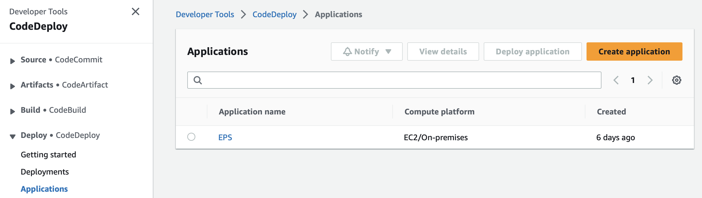
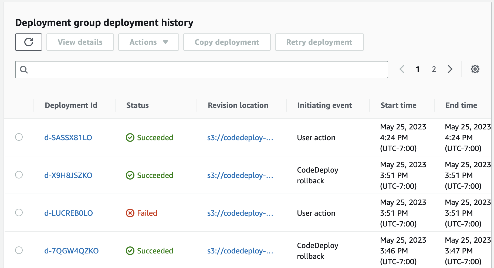

# Integrating AWS CodeDeploy with CodePipeline

[AWS CodeDeploy](https://docs.aws.amazon.com/codedeploy/latest/userguide/welcome.html) is a deployment service that automates application deployments to Amazon EC2 instances, on-premises instances, serverless Lambda functions, or Amazon ECS services.

This project uses CodeDeploy to deploy code to EC2 instances.

CodeDeploy supports both **in place deployment** and **blue/green deployments**.  We will be using an [in place deployment](https://docs.aws.amazon.com/codedeploy/latest/userguide/welcome.html#welcome-deployment-overview-in-place)

## Setup in the target account

### Creating Deployment Groups

In an EC2 deployment, a deployment group is a set of individual instances targeted for a deployment. We will identify the instances that belong to a deployment group based on tags.  

Currently, the framework is configured to use one tag key/value combination. You will need to determine the tag key and value that identifies your deployment group and tag the target EC2 instances accordingly.

### Installing the CodeDeploy agent

The CodeDeploy agent must be [installed on the EC2 instance](https://docs.aws.amazon.com/codedeploy/latest/userguide/codedeploy-agent-operations-install-linux.html)

You can log into the EC2 instance via SSH or preferable via [Session Manager System Manager](https://docs.aws.amazon.com/systems-manager/latest/userguide/session-manager-getting-started.html) and run the following commands to install CodeDeploy.

```bash
sudo yum install -y https://aws-codedeploy-us-east-1.s3.us-east-1.amazonaws.com/latest/codedeploy-agent.noarch.rpm
# verify installation
sudo service codedeploy-agent status
```

There is a sample [CloudFormation template](./misc/vpc-with-ec2.yml) that will create a VPC with an EC2 instance that is accessible via Session Manager if you don't already have one.  It will need to be tagged appropriately to be added to the CodeDeploy deployment group as explained above.


### Deploying resources to the target account via AWS CloudShell

The most straightforward method to deploy the prerequisites to the target account is via [AWS Cloudshell](https://aws.amazon.com/cloudshell/).

Log into the target account, clone this repository and run the following commands.

```bash
export ApplicationName="<the name of the application>"
export EC2TagKey="<the key that specifies the EC2 deployment group>"
export EC2TagValue="<the value of the tag specified above>"
export BASEDIR=$(pwd)
export FrameworkScriptsDir=$BASEDIR/scripts
export TagFile=$BASEDIR/configuration/tag-options.json


cd ./three-stage-cross-account-pipeline-sc-product/components/target-account
bash deploy.sh
```

## Repository configuration

This project includes a [sample Linux Application](../SampleApp_Linux/) to demonstrate deploying an application onto a Linux.  

### Creating a CodeBuild buildspec file.

The [buildspec file](https://docs.aws.amazon.com/codebuild/latest/userguide/build-spec-ref.html) controls the build and deployment process.  You will need a buildspec file modeled after the [included sample](./buildspec-codedeploy.yaml) to deploy to the EC2 instance.

### Creating an appspec file

Your deployed artifact folder should contain an [appspec yaml file](https://docs.aws.amazon.com/codedeploy/latest/userguide/reference-appspec-file.html) to manage the deployment along with the dependent scripts.  The sample Linux application has a simple appspec file and corresponding scripts.

## Monitoring the deployment.

Orchestrating the deployment is done via a CodePipeline deployed in the shared account.  If the cross account deployment fails, the CodePipeline will fail.

To monitor the progress of the CodeDeploy application in more detail, log into the target account, navigate to the CodeDeploy page and click on your application.



Then you can click on the Deployment Group.


to see a list of deployments



If a deployment fails, notice that CodeDeploy will automatically roll back to the prior successful deployment.

You can drill down to the events for further troubleshooting.


