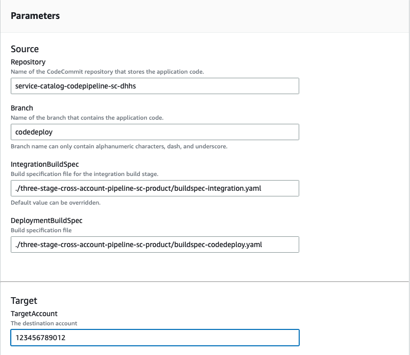

# Setup Instructions for CodeDeploy POC

## Prerequisites

The Target Account has to have the necessary resources deployed from the service-catalog-codepipeline resources.

### Deploy AWS CodeDeploy related resources to allow cross account deployments

Use your temporary credential to change to the target account where the
resources will be deployed or log in to the target account and clone the repository.

This will create the necessary AWS CodeDeploy related resources  in the target account that can be assumed by the DevOps CodeBuild role to deploy to the EC2 instances.

```bash
sudo npm install -g cfn-include

# Use temporary credentials to change to the account containing the git repository
git clone codecommit::us-east-1://service-catalog-codepipeline-sc-dhhs

# This should be set to the DevOps Account
export DevOpsAccount=12345678901

# Make sure you switch back to the current account.
# If you are using CloudShell, use the following commands
unset AWS_SESSION_TOKEN
unset AWS_ACCESS_KEY_ID
#

cd service-catalog-codepipeline-sc-dhhs
export BASEDIR=$(pwd)
export FrameworkScriptsDir=$BASEDIR/scripts
export TagFile=$BASEDIR/configuration/tag-options.json
export RoleName="codebuild-codedeploy-role"

export ApplicationName=sample-app

# This is the tagkey/value combination that determines the CodeDeployment group
# Change the values to align with your organization's naming convention

export EC2TagKey=deployment-group
export EC2TagValue=true

pushd .target-account
bash deploy.sh
popd
```

## Configure EC2 for AWS CodeDeploy

You can either launch an EC2 in an existing VPC that we can access via SSM Session Manager or create or the infrastructure.

There is a [CloudFormation template](./vpc-with-ec2.yml) that you can use to deploy an EC2 instance that you can connect to with SSM Session Manager.

## Install AWS CodeDeploy

Install CodeDeploy on the EC2 instance

```bash
sudo yum install ruby
sudo yum install -y https://aws-codedeploy-us-east-1.s3.us-east-1.amazonaws.com/latest/codedeploy-agent.noarch.rpm
sudo service codedeploy-agent start
# verify installation
sudo service codedeploy-agent status

```


## Launch a CodePipeline product 

- Repository - service-catalog-codepipeline-sc-dhhs
- Branch - codedeploy
- IntegrationBuildSpec - ./three-stage-cross-account-pipeline-sc-product/buildspec-integration.yaml
- DeploymentBuildspec - ./three-stage-cross-account-pipeline-sc-product/buildspec-codedeploy.yaml




