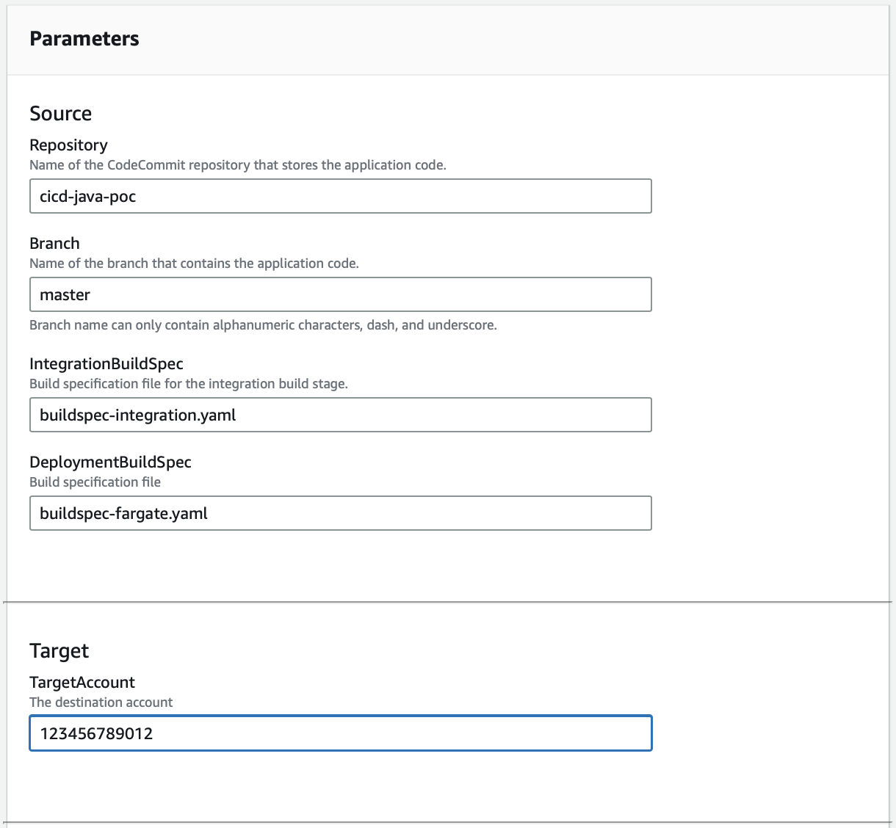

# Fargate ECS Docker CodePipeline Proof of Concept

This Git repository contains a Java sample application that uses Spring Boot to create a "Hello World" API. The repository includes all the necessary files and configurations to build the application, create a JAR file, and deploy it using AWS CloudFormation and Amazon Elastic Container Service (ECS) with Fargate.

## Deployed Resources

- An [AWS ECS Cluster](https://docs.aws.amazon.com/AmazonECS/latest/developerguide/clusters.html) groups together tasks, and services.
- A [task definition](https://docs.aws.amazon.com/AmazonECS/latest/developerguide/task_definitions.html) is a blueprint for your application. It is a text file in JSON format that describes the parameters and one or more containers that form your application
- An [ECS Task execution role](https://docs.aws.amazon.com/AmazonECS/latest/developerguide/task_execution_IAM_role.html) - grants the Amazon ECS container and Fargate agents permission to make AWS API calls on your behalf
- A [Task IAM role](https://docs.aws.amazon.com/AmazonECS/latest/developerguide/task-iam-roles.html)
- An Autoscaling role that gives AWS permission to perform autoscaling events
- Two [Security Groups](https://docs.aws.amazon.com/vpc/latest/userguide/vpc-security-groups.html) - one for the autoscaling group and one for your ECS Service.
- An [ECS Service](https://docs.aws.amazon.com/AmazonECS/latest/developerguide/ecs_services.html) containing 1 or more autoscaling instances of the Docker container with the sample API.
- An [Application Load Balancer](https://docs.aws.amazon.com/elasticloadbalancing/latest/application/introduction.html)

## Directory structure

```bash
.
├── README.md                               -- This file
├── buildspec.yaml                          -- used for the CodeBuild Deployment phase
├── buildspec-integration.yaml              -- used for the CodeBuild integration phase
├── components
│   ├── deploy-subdirectory-templates.sh    -- iterates through the child folders and deploys templates
│   ├── deploy-template.sh                  -- deploys a single template with sam
│   ├── deploy.sh                           -- wrapper for consistency
│   ├── ecs 
│   │   ├── fargate.json                    -- maps environment variables to fargate stack
│   │   └── fargate.yml                     -- used to deploy and update the fargate ECS service
├── configuration                           
│   └── tag-options.json                    -- config file used to tag resources created by the pipeline
├── deploy.sh                               -- deploys this repository
├── docker-rest-api                         -- sample API
│   ├── Dockerfile                          -- sample Dockerfile
│   ├── pom.xml                             -- Maven sample file
│   ├── src                                 -- source code for the API
├── fargate-envs.sh                         -- environment variables containing settings for Fargate
├── scripts                                 -- helper scripts
├── target-account                          -- resources for target accounts
│   ├── codebuild-fargate.json              -- maps environment variables to Codebuild role template
│   ├── codebuild-fargate.yml               -- creates Codebuild role for cross account access

```

## Populating Parameter values

Each CloudFormation template can have an optional corresponding ```.json``` file.  The template that is used to deploy the container is at [./components/ecs/fargate.yml](./components/ecs/fargate.yml).

The corresponding JSON file is used to map environment variables to CloudFormation parameters.

```json
{
    "Configuration": [
        {
            "Key":"StackName",
            "Value":"${FargateStackName}",
            "Description":"This is the name of the Stack.  Ugly hack."
        },
        {
            "Key": "VPC",
            "Value": "${VPC}"
        },
        {
            "Key": "SubnetA",
            "Value": "${SubnetA}"
        }
```

The ```fargate-env.sh``` is used to assign values to the environment variables.

## Usage

- Modify the ```fargate-envs.sh``` file to contain the variables for your environment.  See the comments in the file for more information.
- Push the code to the DevOps account.
- Ensure that the target account has [permission to access ECR in the shared account.](https://repost.aws/knowledge-center/secondary-account-access-ecr)
- Deploy the [codebuild-fargate,yml](./target-account/codebuild-fargate.yml) CloudFormation template in  the target account.
- Create an AWS CodePipeline using Service Catalog


