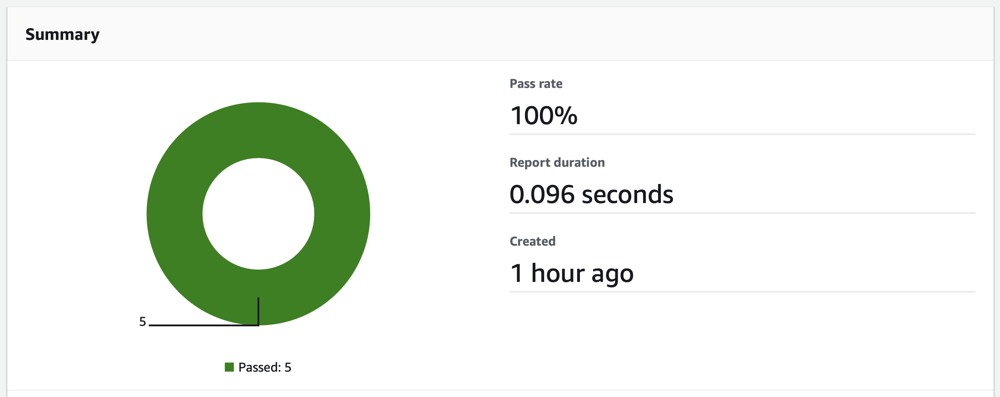
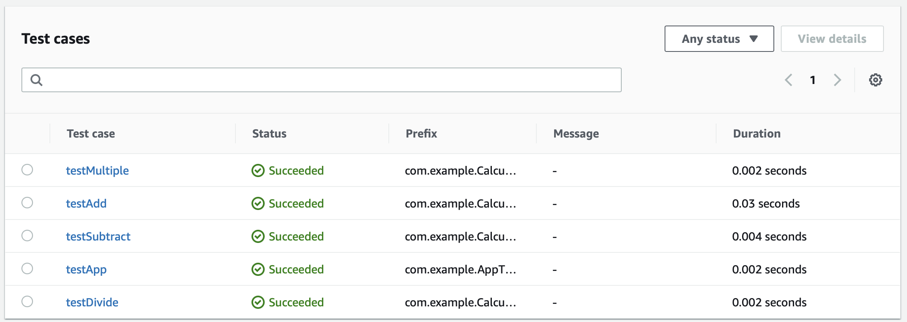

# Working with test reporting in AWS CodeBuild

You can create reports in CodeBuild that contain details about tests that are run during builds. You can create tests such as unit tests, configuration tests, and functional tests.

## Sample Java code

This repository include a simple Java ```Calculator``` class with 5 passing unit tests in the ```codebuild-test-integration``` folder.  

It is configured to use [Maven](https://maven.apache.org/what-is-maven.html) to run the tests.

The included ```buildspec-integration.yaml``` file runs the tests:

```yaml
  build:
    commands:
      - cd codebuild-test-integration
      - mvn clean test -Dmaven.test.failure.ignore=true 
```

And tells AWS CodeBuild where to find the resulting JUnit results:

```yaml
reports:
  testReport:
    files:
      - '**/surefire-reports/TEST-*.xml'
    discard-paths: yes
```

## Viewing test results

From your CodePipeline, choose ```Details``` under the integration phase.


Then choose ```Reports``` from the CodeBuild run.


Click on the report and then you will see a graph of reports that passed and failed.



And an individual list of tests.

