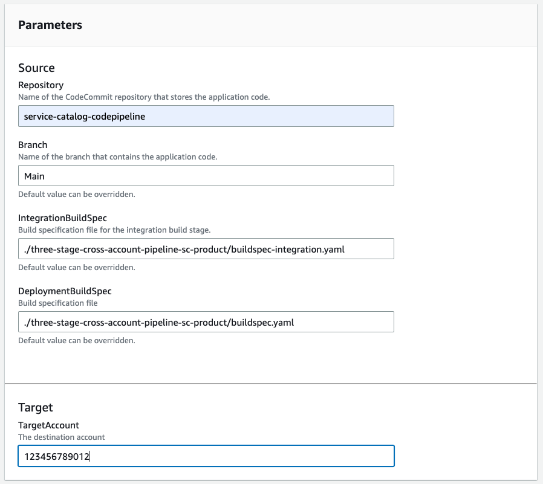

# Service Catalog CodePipeline product

## What is CodePipeline?

[AWS CodePipeline](https://aws.amazon.com/codepipeline/) is a fully managed continuous delivery service that helps you automate your release pipelines for fast and reliable application and infrastructure updates.


## The Cross Account CodePipeline Product

Once provisioned, this CodePipeline automatically runs when code is pushed to its source [CodeCommit](https://aws.amazon.com/codecommit/) repository.  It contains three stages after the source code is retrieved.


1. **CodeBuild Integration Phase**.  Here you can run any automated tests and static code scanning tools
2. **Deployment Approval**. This allows a Release Manager to either approve or reject the deployment based on the results of the Integration phase. 
3. **CodeBuild Deployment Phase**. This phase is meant to allow you to run any necessary commands to deploy your code. AWS CodeBuild, based on the buildspec file, will assume a role in the target account to allow for cross account deployments.

[AWS CodeBuild](https://aws.amazon.com/codebuild/) is a fully managed continuous integration service that compiles source code, runs tests, and produces ready-to-deploy software packages.

Your repository needs to have a [buildspec](https://docs.aws.amazon.com/codebuild/latest/userguide/build-spec-ref.html) with a list of commands to run. A sample buildspec file is in included for both the [integration phase](../buildspec-integration.yaml) and the [deployment phase](../buildspec.yaml).

## Service Catalog Portfolios and Products

This solution deploys one Service Catalog Portfolio.


which includes *products*...


## Provisioning a product

From the Service Catalog web page, go to *Products*

Click on the *Cross Account Three stage AWS CodePipeline* and then click on *Launch Product*


Now you can enter the name of the repository to deploy, the branch, the buildspec files, and the target account number.


Once you enter parameters, click on **Launch Product**.

Once you click on **Launch Product**, you can go to ```Provisioned products``` and see the created resources.


For a general overview about the user experience for Service Catalog, please see the [Using Service Catalog](../USING_SERVICE_CATALOG.md) documentation.

## Deployed Resources

### IAM Roles

Two IAM Roles are deployed

- [x-acct-codepipeline-role-${AWS::Region}](./components/codepipeline/simple-codepipeline.yml) -- the role used by [AWS CodePipeline](https://aws.amazon.com/codepipeline/).
- [x-acct-cbd-${Repository}-${Branch}-${AWS::Region}](./components/codepipeline/simple-codepipeline.yml) -- the role used by [AWS CodeBuild](https://aws.amazon.com/codebuild/).  This role should be modified and given the necessary permissions to do the deployment.  Currently it has the permissions needed to deploy this repository. This role will also be deployed to the target account with a [Trust Policy](https://aws.amazon.com/blogs/security/how-to-use-trust-policies-with-iam-roles/)

### AWS EventBridge

An [An AWS EventBridge](https://docs.aws.amazon.com/AmazonCloudWatch/latest/events/CloudWatch-Events-tutorial-codebuild.html) event is created that instantiates the pipeline when code is pushed to the source repository and branch.


### AWS CodePipeline

An AWS CodePipeline is deployed based on the name of the source [AWS CodeCommit](https://aws.amazon.com/codecommit/)

### Amazon S3

When AWS Codepipeline pulls the code from AWS CodeCommit, it zips the source code and copies it to an S3 bucket.  The S3 Bucket is then used throughout the pipeline.
### AWS CodeBuild

Two [AWS CodeBuild](https://aws.amazon.com/codebuild/) projects.

- An *Integration* CodeBuild Project
- A *Deployment* CodeBuild Project


## Using the Provisioned CodePipeline

The provided CodePipeline product can be used to deploy this reposity.

Two [Codebuild buildspec files](https://docs.aws.amazon.com/codebuild/latest/userguide/build-spec-ref.html) are included:

- [buildspec-integration.yaml](./buildspec-integration.yaml) -- used in the integration phase.  It runs static analysis tools for both the CloudFormation templates and the Python code.
- [buildspec.yaml](./buildspec.yaml) -- used in the deployment phase. 

Assuming this repository has been pushed to an [AWS CodeCommit](https://aws.amazon.com/codecommit/) repository named ```service-catalog-codepipeline```, the following parameter values will create a CodePipeline that will deploy the repository when you push updates to it.




## Deployment 


## Deploying the Service Catalog Product

### Deploy the Service Catalog Product

The most straightforward method to deploy this solution involves logging into your AWS account with the appropriate permissions and using [AWS CloudShell](https://aws.amazon.com/cloudshell/)

Log into your AWS account, navigate to the CloudShell page and clone the repository.


After you clone the repository, run the following commands.

```bash

# These environment variables are referenced in the configuration file.
# Set the TargetAccount to the current accountnumber
export TargetAccount=$(aws sts get-caller-identity  | jq -r ".Account")
export Repository="x-acct-codepipeline"
export Branch="main"

# if the Service Catalog Framework hasn't been deployed, deploy it first
bash deploy.sh

#
bash deploy-service-catalog-product.sh ./three-stage-cross-account-pipeli
ne-sc-product/cross-account-codepipeline.yml ./three-stage-cross-account-pipeline/cross-account-codepipeline.json x-acct-pipeline-product
```

### Deploy IAM Roles to allow cross account deployments

Use your temporary credential to change to the target account where the
resources will be deployed or log in to the target account and clone the repository.

This will create an IAM role in the target account that can be assumed by the DevOps CodeBuild role
to deploy resources to this account.

```bash
bash deploy-template.sh s3/x-acct-codepipeline-sourcebucket.yml
bash deploy-template.sh roles/x-acct-codebuild-role.yml
```
